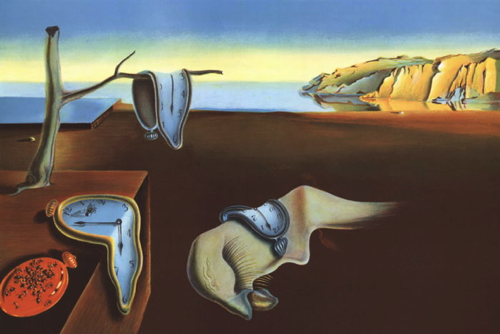

# Seam Carving

My 2021 Swift Student Challenge (WWDC Scholarship) submission.

It guides you along the creation of a seam carving algorithm (a method of content-aware resizing images). The goal of the playground is to showcase both the application and implementation of this algorithm. I hope learning about how the algorithm functions will give an appreciation for the algorithm itself and demonstrate how to approach optimization from the angle of dynamic programming.

## Demo

The seam carving algorithm in the playground takes the input of:

and turn it into:

## Pages

1. Explains image convolutions and then uses them to implement edge detection using a Sobel filter.
2. Implements an algorithm to find the path through an image which avoids the edges found in using the Sobel filter. Also explains how dynamic programing is utilized in optimizing that algorithm.
3. Uses the seam finding function found on the previous page to resize images by larger amounts. Also explores potential optimizations and their tradeoffs.
4. An interactive live view that lets you experience everything that was covered (with support for using your own images).
